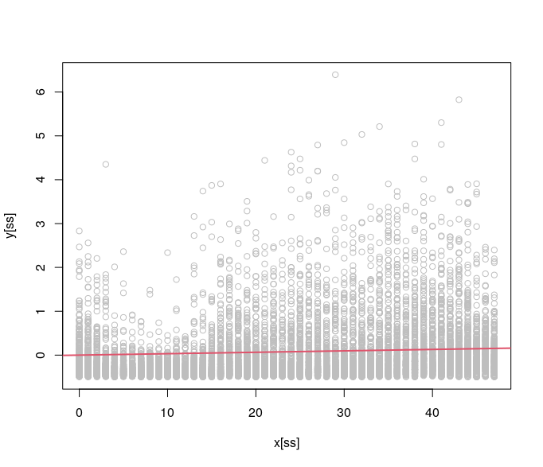
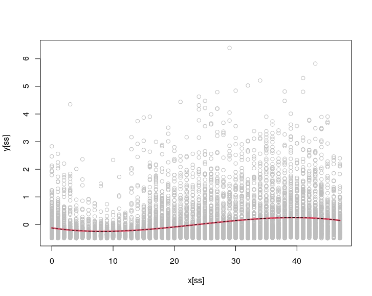
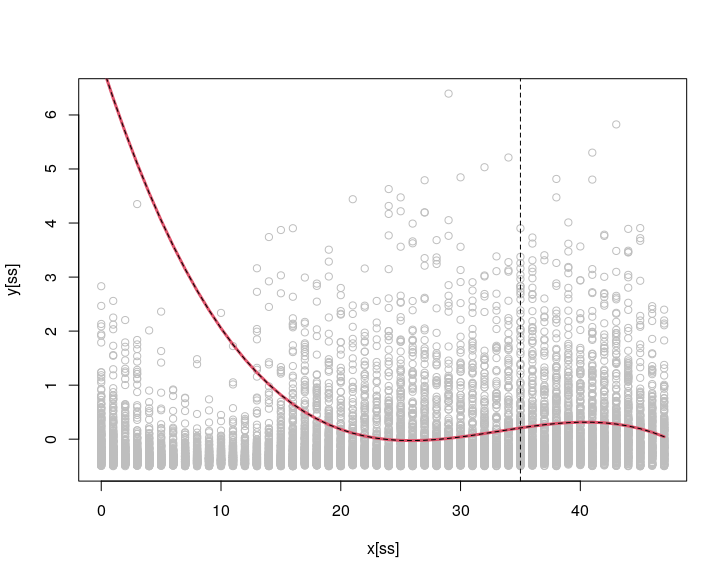
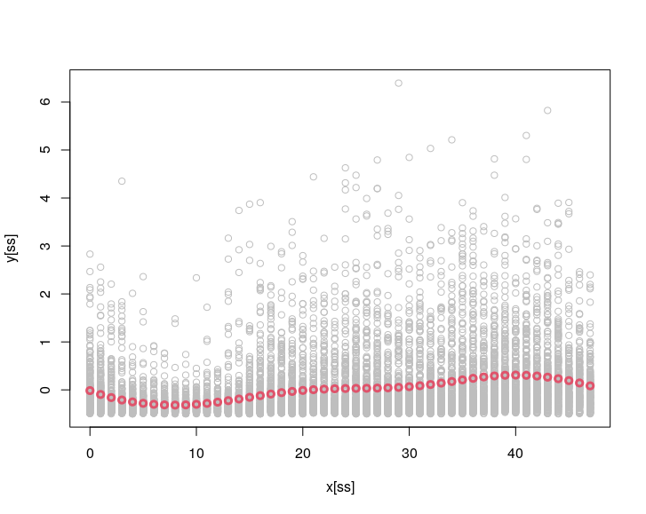

<style>
body {
text-align: justify}
</style>

### Smoothing by local polynomial regression

Consider the Irish smart metering data set presented in a previous chapter: 
```{r, message=FALSE}
library(electBook)
data(Irish)
```
Let us concatenate the electricity demand from all households into a single vector:
```{r}
y <- do.call("c", Irish$indCons)
y <- y - mean(y)
str(y)
```
We have over 44 million observations, here we plot as sub-set:
```{r}
ncust <- ncol(Irish$indCons) 

x <- rep(Irish$extra$tod, ncust)

n <- length(x)
ss <- sample(1:n, 1e4)
plot(x[ss], y[ss], col = "grey")
```
where the $x$-axis here represents the time of day (0 is midnight and 47 is 23:30).

We want to model the relation between the time of day (`x`) and the demand (`y`). We start with a simple univariate regression model $\mathbb{E}(y|x) = \beta_1 x$ (note that we do not need an intercept as we have centered `y` above). Here is a simple function to fit the model by least squares:
```{r}
reg1D <- function(y, x){
  
  b <- t(x) %*% y / (t(x) %*% x)  
  
  return(b)
  
}
```
Let's compare this with the standard `lm()` function:
```{r, eval = FALSE}
system.time( lm(y ~ -1 + x)$coeff )[3]
# elapsed 
# 11.518 

system.time( reg1D(y, x) )[3]
# elapsed 
#    0.92
```
Note that `lm` is much slower (probably because it computes many quantities that our function does not compute). 

**Q1 start** Implement a parallel version of `reg1D` using `RcppParallel`. You might
want use OpenMP and/or some of the functions provided by `RcppParallel` (e.g., `parallelReduce`) to parallelise you code. Make sure that you use thread-safe data structures. Compare your function to `reg1D` in terms of exactness and timing. **Q1 end**

Looking at the scatterplot above, it is clear that the linear model will provide a poor fit, in fact:
```{r, eval = FALSE}
ss <- sort( sample(1:n, 1e4) )
plot(x[ss], y[ss], col = "grey")
abline(a = 0, b = reg1D(y, x), col = 2, lwd = 2)
```

is arguably a pretty poor fit! Let's try to do better by fitting a polynomial regression such as $\mathbb{E}(y|x) = \beta_0 + \beta_1 x + \beta_2 x^2 + \beta_3 x^3$ (note that we have included an intercept here, despite $y$ being centered. The reason will become clear later on). A multivariate linear regression model, with model matrix `X`, can be fitted using the following function:
```{r}
regMD <- function(y, X){
  
  XtX <- t(X) %*% X
  
  C <- chol(XtX)
  
  b <- backsolve(C, forwardsolve(t(C), t(X) %*% y) )
  
  return(b)
  
}
```
This function calculates the cholesky decomposition $\bf C^T \bf C = \bf X^T \bf X$ where $\bf C$ is upper triangular. Then $\hat{\bf \beta} = \bf C^{-1}\bf C^{-T}\bf X^T\bf y$, which is solved by computing $\bf z = \bf C^{-T}\bf X^T\bf y$ by forward-solving the lower-triangular system and then $\hat{\bf \beta} = \bf C^{-1} \bf z$ by back-solving the upper-triangular system. Let's see whether our function works:
```{r, eval = FALSE}
X <- cbind(1, x, x^2, x^3)

b <- regMD(y, X)

b_lm <- lm(y ~ -1 + X)$coeff

Xu <- cbind(1, 0:47, (0:47)^2, (0:47)^3)
plot(x[ss], y[ss], col = "grey")
lines(0:47, Xu %*% b, col = 2, lwd = 3)
lines(0:47, Xu %*% b_lm, col = 1, lty = 2)
```

As one would hope, our solution coincides with the one provided by `lm()`.

**Q2 start** Implement a parallel version of `regMD` using `RcppParallel` and compare your function to `regMD` in terms of exactness and timing. **Q2 end**

The polynomial fit is better but we can do even better using local polynomial regression.
This is a function for basic one dimensional local polynomial regression (using a Gaussian kernel):
```{r}
regMD_local <- function(y, X, x0, x, h){
  
  w <- dnorm(x0, x, h)
  w <- w / sum(x) * length(y)
  
  wY <- y * sqrt(w)
  wX <- X * sqrt(w)
  wXtwX <- t(wX) %*% wX
  
  C <- chol(wXtwX)
  
  b <- backsolve(C, forwardsolve(t(C), t(wX) %*% wY) )
  
  return(b)
  
}
```
As always, it is work checking whether our function works by comparing it with `lm()`:
```{r, eval = FALSE}
b <- regMD_local(y, X, x0 = 35, x = x, h = 5)
b_lm <- lm(y ~ -1 + X, weights = dnorm(35, x, 5))$coeff

plot(x[ss], y[ss], col = "grey")
lines(0:47, Xu %*% b, col = 2, lwd = 3)
lines(0:47, Xu %*% b_lm, col = 1, lty = 2)
abline(v = 35, lty = 2)
```



It seems so. To evaluate our fitted function at several points on the $x$-axis, we do (NOTE this takes a few minutes to run):
```{r, eval = FALSE}
f <- lapply(0:47, function(.x ) regMD_local(y, X, x0 = .x, x = x, h = 5))

plot(x[ss], y[ss], col = "grey")
lines(0:47, sapply(1:48, function(ii) Xu[ii, ] %*% f[[ii]]), col = 2, lwd = 3, type = 'b')
```

  

**Q3 start** Implement a parallel version of `regMD_local` using `RcppParallel` and compare your function to `regMD_local` in terms of exactness and timing. **Q3 end**

**Q4 start** Consider these lines of code:
```{r, eval = FALSE}
  w <- dnorm(x0, x, h)
  w <- w / sum(x)
```
In principle the weights should sum to one, but for example: 
```{r, eval = FALSE}
x <- c(100, 200, 300)
( w <- dnorm(0, x, 1) )
( w <- w / sum(x) ) 
```
as you can see, all the weight are 0! The numerically stable way of computing this is:
```{r, eval = FALSE}
x <- c(100, 200, 300)
lw <- dnorm(0, x, 1, log = TRUE)
mlw <- max(lw)
( w <- exp(lw - mlw) / sum(exp(lw - mlw)) ) 
```
Think about why this solution is preferable and implement a parallel version of it.
**Q4 end**

**Q4 start** Assume that new data becomes available, that is the model matrix is updated to $\bf X \leftarrow [\bf X_{\text{old}}^T, \bf X_{\text{new}}^T]^T$ (new rows of data have been added). Assuming that you have stored $\bf X_{\text{old}}^T \bf W_{\text{old}} \bf X_{\text{old}}$, how would you efficiently update your fit? **Q4 end**
